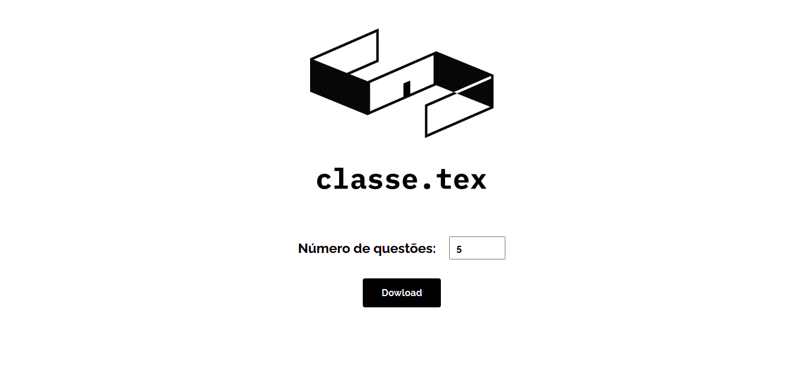
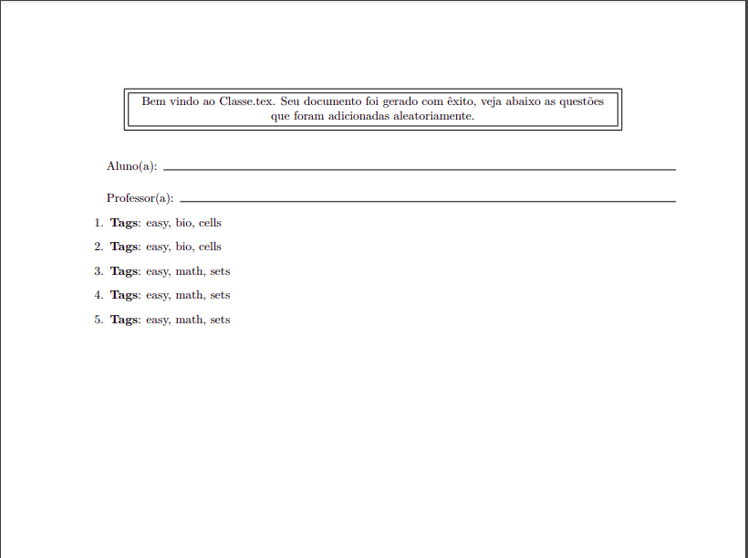

# Classe.tex



A ideia básica aqui é, um site que gera listas com exercícios selecionados de forma aleatória a partir de arquivos Latex.

As questões são selecionadas de acordo com tags, estas estão na primeira linha do arquivo .tex de cada questão. Então, é possível gerar, por exemplo, provas com a primeira questão selecionada a partir de todas as questões com a tag `easy`, a segunda a partir das questões com as tags `medium` e `math`, e assim por diante.

```tex
%<tags>easy, math, sum</tags>%

\textbf{Hipótese de indução}: Seja $a \in \mathbb{N}$ tal que, $P(k)$, para todo $k \in [0..a]$
\begin{eqnarray*} ... \end{eqnarray*}
\\
\textbf{Passo Indutivo}: Vamos provar que $P(a+1)$.
\begin{eqnarray*} ... \end{eqnarray*}
Pela hipótese da indução, temos que $|...|$, então:
\begin{eqnarray*} ... \end{eqnarray*}
Portanto $P(a+1)$.
\\
\textbf{Base Indutiva}: Vamos provar que $P(k)$, para todo $k \in \mathbb{N}$ ao qual o argumento do Passo de Indução não se aplica.
```

As questões são adicionadas a um template, que pode ser totalmente customizado. Os exercícios são inseridos onde está a tag `content`, veja abaixo:

```tex
\documentclass{exam}
\usepackage[utf8]{inputenc}
\usepackage[brazil]{babel}
\usepackage{import}

\begin{document}

\begin{center}
\fbox{\fbox{\parbox{5.5in}{\centering
Bem vindo ao Classe.tex. 
Seu documento foi gerado com êxito, veja abaixo as questões que foram adicionadas aleatoriamente.
}}}
\end{center}
\vspace{5mm}
\makebox[\textwidth]{Aluno(a):\enspace\hrulefill}
\vspace{5mm}

\makebox[\textwidth]{Professor(a):\enspace\hrulefill}

\begin{questions}

%<content/>%

\end{questions}
\end{document}
```

Exemplo de arquivo gerado:


## Como

Este projeto foi construído em Python, utilizando Django + [django-tex](https://pypi.org/project/django-tex/)
